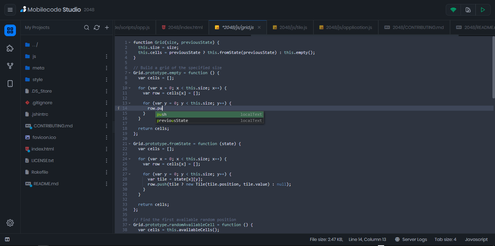
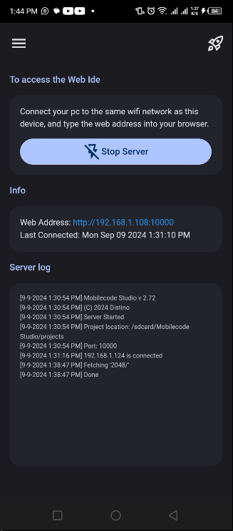
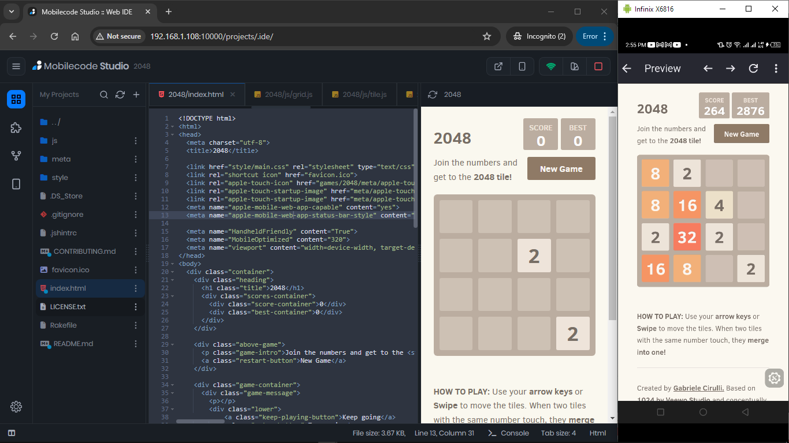

# Mobilecode Studio

Access the IDE on any PC with a modern browser, just by running the server on your phone.

### Web IDE & Mobile app screenshots

### Showing Preview on Browser & Phone

## Highlights

- Code on any Modern Web Browser.
- Preview your Projects live on your phone and browser
- Markdown preview support
- Extension support
- File browser
- Upload files to device and download from device
- Access to various themes for the IDE and editor
- NodeJS project support (Coming soon)
- And more..
<!--- Push your projects to GitHub (Coming soon)-->

## Requirements

- An Android phone (Requires Android 7.0 and up)
- A PC with a Browser version of 99+ (Preferably Chrome)

## Getting started

<!--1. Download [MobileCodeServer](https://mobilecodeserver.org) from [PlayStore](https://play.google.com/com.distino.mobilecodeserver)
1. Join this [group](https://groups.google.com/g/mobilecodestudio), before downloading the app.-->
1. Download Mobilecode Studio from [Releases](https://github.com/Mobilecode-Studio/Site/releases) or [APkpure](https://apkpure.com/mobilecode-studio/com.distino.mobilecodestudio)
2. After installing the app, connect your PC to the same network as your mobile phone
3. Start the server
4. Enter the IP address into your Web Browser(Preferably Chrome)
5. Start Coding⚡⚡⚡

# Docs
[Extensions API](./docs/extensions-API.md)
